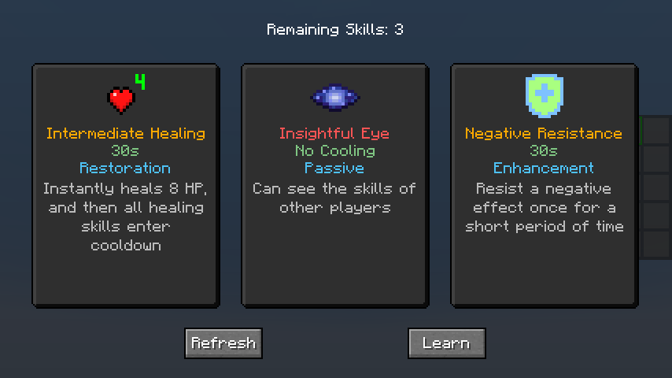
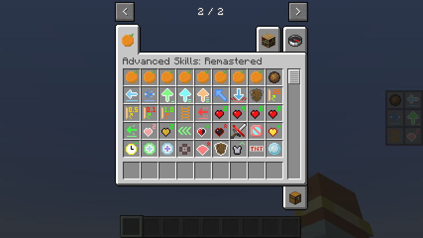
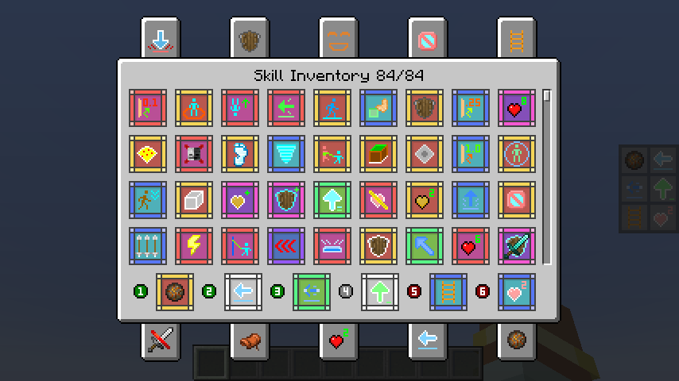
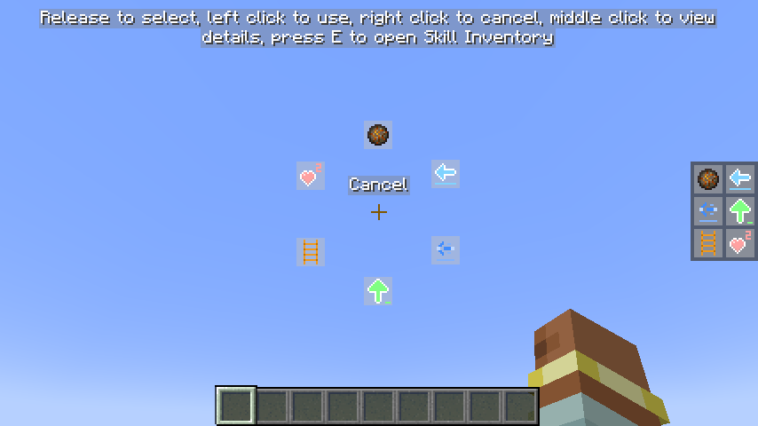
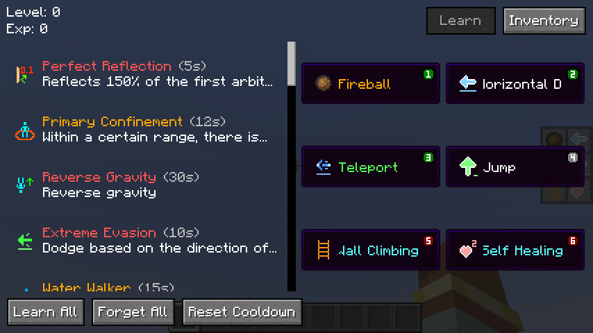
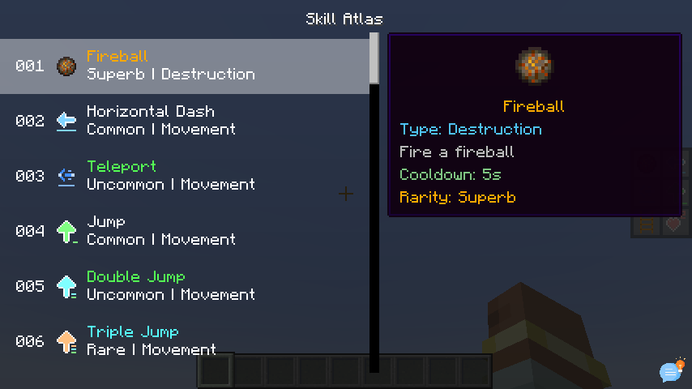

## Advanced Skills: Remastered

[中文](README.md)

### **Required Mods:**

1. `Fabric Language Kotlin` / `Kotlin for Forge`
2. `Architectury API`

---

### **Gameplay Introduction:**

1. Players can gain **Skill Experience** alongside **Vanilla Experience** (viewable in the skill list screen). Every few levels, they can randomly choose to learn a new skill.
2. Open the skill list with the hotkey (**K** by default), equip skills to the skill slots, and press the corresponding hotkey to use the skill. Alternatively, hold the **Quick Cast** hotkey (**R** by default) and move the mouse to select or use the skill. When a skill is selected, pressing the **Quick Cast** hotkey again will instantly release the skill.
3. Players start with 6 skill slots:
    - 3 **Active** slots
    - 1 **Generic** slot
    - 2 **Passive** slots

   Except for the Generic slot, other slots can only equip corresponding types of skills. A maximum of 10 skill slots can be active at once.
4. Players can modify the number of skill slots and the types of skills in each slot via commands.
5. Using skills does not consume any resources, but most skills have a cooldown after use (Can be modified by command).
6. Some skills are continuous and require holding down the button to charge up. However, if the skill is cast using **Quick Cast**, no need to hold the button—it will persist until it ends, unless manually interrupted by using the skill again.

---

### **Sample Skills Introduction:**

- **Reflective Skills**: Skills that have a certain chance of reflecting the first incoming damage within a specific time.  
   Different types of reflective effects exist.

- **Movement Skills**: Includes various movement abilities, such as dashing, teleporting, dodging, jumping, grappling, etc.

- **Control Skills**: Includes various control abilities, such as immobilizing, slowing, silencing, etc.

- **Passive Skills**: All skills that are not passive are considered active. Passive skills include self-healing, passive effects, wall climbing, invisibility, and more.

- **Enhancement Skills**: Various enhancement skills, such as X-ray vision, water bypassing, and resistance to negative effects.

- **Summoning Skills**: Includes summoning duplicates, mounts, minions, etc.

- **Healing Skills**: Different healing skills restore varying amounts of health.

- **Destructive Skills**: Includes fireballs, TNT, meteorites, etc.

---

### **Command Overview:**

  
 /skills 

- `equip [skill] [slot]` - Equip a skill to a skill slot
- `unequip [slot]` - Unequip the skill from the specified slot
- `list` - List all learned skills
- `learn [skill]` - Learn a new skill
- `learn-all` - Learn all skills
- `forget [skill]` - Forget a skill
- `forget-all` - Forget all skills
- `reset` - Reset all skill data
- `reset-cooldown` - Reset all skills' cooldowns

#### Skill Slot Commands:

- `slot`
    - `add [active/passive/generic]` - Add a new skill slot
    - `remove [slot]` - Remove a skill slot
    - `reset` - Reset to default skill slots

#### Slot Queries & Settings:

- `slots` - Query the number of default skill slots
    - `active` - Query the number of default active skill slots
        - `[slot]` - Set the number of default active skill slots
    - `generic` - Query the number of default generic skill slots
        - `[slot]` - Set the number of default generic skill slots
    - `passive` - Query the number of default passive skill slots
        - `[slot]` - Set the number of default passive skill slots
    - `reset` - Reset to the default number of skill slots

#### Skill Experience:

- `xp`
    - `add [amount] [points/levels]` - Add skill experience or levels
    - `set [amount] [points/levels]` - Set skill experience or levels
    - `query [points/levels]` - Query current skill experience or levels
    - `multiplier [multiplier]` - Set global skill experience gain multiplier
    - `reset` - Reset skill experience and levels

#### Global Cooldown:

- `cooldown` - Query global skill cooldown multiplier
    - `reset` - Reset global skill cooldown multiplier
    - `[multiplier]` - Set global skill cooldown multiplier

#### Modify Skill Settings:

- `modify [skill]`
    - `cooldown [seconds]` - Modify skill cooldown time
    - `rarity [rarity]` - Modify skill rarity
    - `time [seconds]` - Modify skill duration (charging time)
    - `reset` - Remove all modifications to the skill

#### Blacklist Commands:

- `blacklist`
    - `add [skill]` - Add skill to blacklist
    - `remove [id]` - Remove skill from blacklist by ID
    - `list` - List all blacklisted skills
    - `clear` - Clear skill blacklist

---

### **Skill Fruit:**

**Each rarity has a corresponding skill fruit. After eating it, you can randomly learn a skill. The highest rarity depends on the rarity of the skill fruit.**

#### How to get it:

- Oak Leaves - 0.5%
- Dark Oak Leaves - 0.5%
- Fishing - Same as the treasure
- Ancient City Chest - 25%
- Buried Treasure Chest – 25%
- End City Treasure Chest - 25%
- Spawn Bonus Chest - 100%

#### Rarity Weight:

|  **Rarity**   | **Weight** |
|:-------------:|:----------:|
|    Common     |     8      |
|   Uncommon    |     7      |
|     Rare      |     6      |
|    Superb     |     5      |
|     Epic      |     4      |
|   Legendary   |     3      |
|    Mythic     |     2      |
|    Unique     |     1      |

---

### **Useful Tips:**

1. In the inventory screen, press the **View Skill List** hotkey (**K** by default) to directly open the skill inventory.
2. In creative mode, you can quickly learn all skills and reset skill cooldowns in the **Skill List** screen (requires permission).
3. In the **Skill List** screen, left-click to double-click a skill to view its detailed description in the skill gallery. Hold **Shift** to display the full skill description.
4. In the **Skill Inventory** screen, you can quickly equip/swap skills using the hotkeys (**1-0** on the top row of the keyboard), and **Shift + Left Click** can quickly equip or unequip skills. Otherwise, you can press and hold **Shift** to view skill details.
5. In the **Quick Cast** screen, press the **Open/Close Inventory** hotkey (**E** by default) to directly open the skill inventory.
6. In the **Quick Cast** screen, when a skill is selected, press the middle mouse button in the **Cancel** area to deselect the skill.
7. You can use the hotkey (**N** by default) to move the skill slots.
8. If you feel that the **cooldown**, **rarity**, or **duration** of some skills are inappropriate, you can use the command (`/skills modify`) to modify them. Of course, you can also give me feedback on unreasonable situations, and I can directly modify the default value.

---

### **Images:**

 

