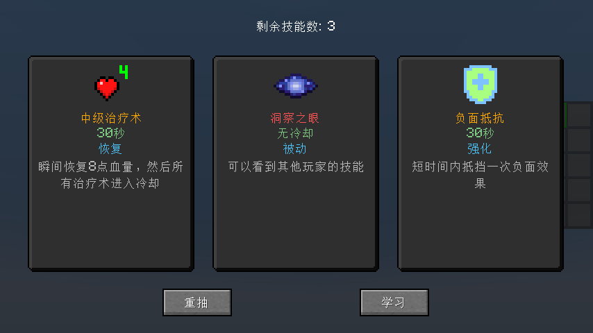
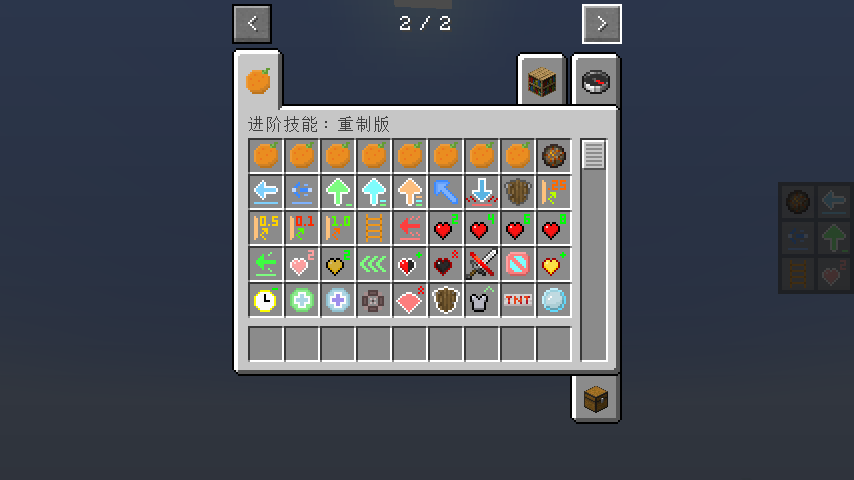
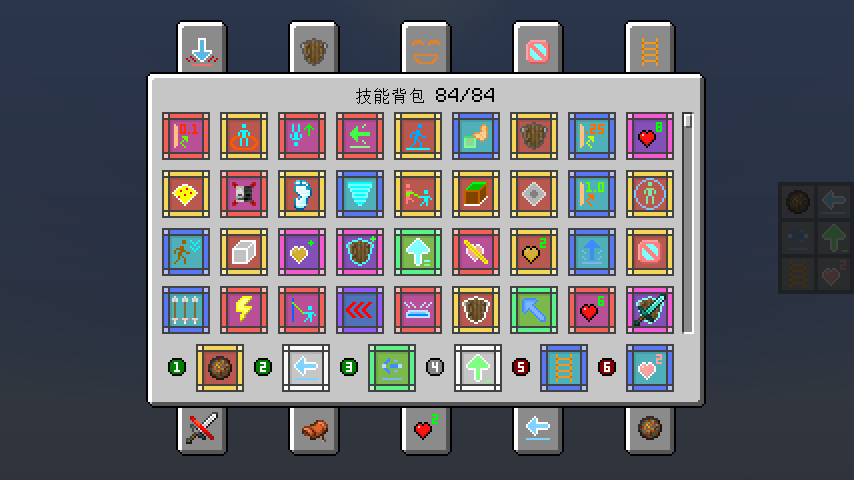
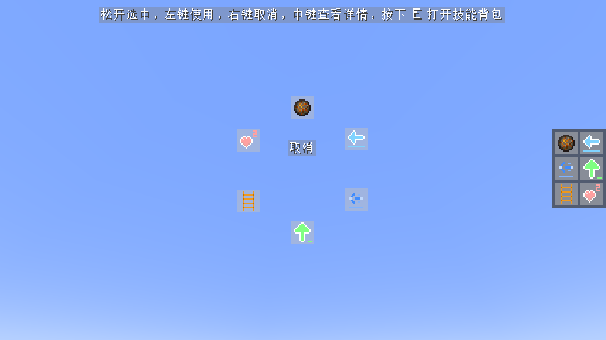
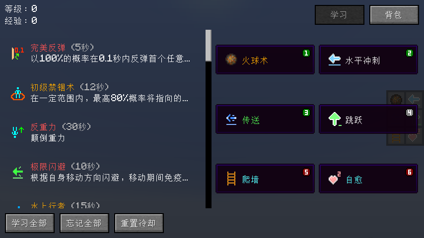
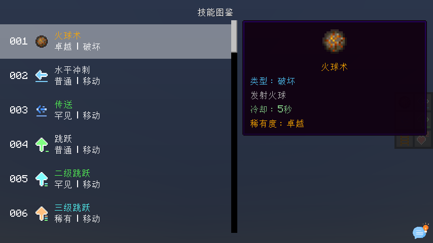

## 进阶技能: 重制版

[English](README-en_us.md)

### 前置模组:

1. Fabric Language Kotlin(Fabric) / Kotlin for Forge(Forge)
2. Architectury API

### 玩法介绍:

1. 玩家可以在获取**原版经验**的同时增加**技能经验**(在技能列表界面查看)，每几级可以随机学习一个新技能。
2. 通过快捷键(默认K)打开技能列表，装备技能到技能槽上，按下对应的快捷键进行使用技能，或者按住**快捷施法**快捷键(默认R)并拖动鼠标选择或使用技能，已选中技能时，再次按下**快捷施法**快捷键可以立即释放技能。
3. 玩家默认有6个技能槽，其中3个**主动**技能槽，1个**通用**技能槽和2个**被动**技能槽。除了通用技能槽外，其他技能槽只能装备对应类型的技能。最高允许同时存在10个技能槽。
4. 玩家可以通过指令来修改技能槽的数量，以及技能槽的技能类型。
5. 使用技能无需消耗任何资源，但是大部分技能使用后有一个冷却时间(可以通过指令修改)。
6. 有些技能是持续的，需要长按以蓄力使用。但是如果是通过快捷施法使用的技能，无需长按，它会持续到结束，除非玩家手动再次使用技能以中断。

### 部分技能介绍:

1. **反弹类技能**: 以一定概率在一定时间内反弹首个任意伤害，不同类型的反弹效果不同。
2. **位移技能**: 有多种位移技能，包括冲刺、传送、闪避、跳跃、抓钩等。
3. **控制类技能**: 有多种控制类技能，包括禁锢、减速、沉默等。
4. **被动技能**: 除了被动技能以外的技能，均为主动技能。被动技能包括自愈、被动效果、爬墙、隐身等。
5. **强化类技能**: 有多种强化类技能，包括透视、无视液体、负面抵抗等。
6. **召唤类技能**: 例如分身、坐骑、仆从等。
7. **治疗类技能**: 不同等级的治疗技能可以恢复不同血量。
8. **破坏类技能**: 包括火球、TNT、陨石等。

### 指令介绍:

#### /skills

- `equip [skill: 技能] [slot: 技能槽位(1-10)]` - 装备技能到技能槽
- `unequip [slot: 技能槽(1-10)]` - 卸下技能槽上的技能
- `list` - 列出所有已学习技能
- `learn [skill: 技能]` - 学习新技能
- `learn-all` - 学习所有技能
- `forget [skill: 技能]` - 忘记技能
- `forget-all` - 忘记所有技能
- `reset` - 重置所有技能数据
- `reset-cooldown` - 重置所有技能的冷却时间
- `slot`
    - `add [active: 主动/passive: 被动/generic: 通用]` - 增加一个技能槽
    - `remove [slot: 技能槽位(1-10)]` - 移除技能槽
    - `reset` - 重置至默认技能槽
- `slots` - 查询默认技能槽数量
    - `active` - 查询默认主动技能槽数量
        - `[slot: 技能槽位(1-10)]` - 设置默认主动技能槽数量
    - `generic` - 查询默认通用技能槽数量
        - `[slot: 技能槽位(1-10)]` - 设置默认通用技能槽数量
    - `passive` - 查询默认被动技能槽数量
        - `[slot: 技能槽位(1-10)]` - 设置默认被动技能槽数量
    - `reset` - 重置至默认技能槽数量
- `xp`
    - `add [amount: 数量] [points: 点数/levels: 等级]` - 增加技能经验/等级
    - `set [amount: 数量] [points: 点数/levels: 等级]` - 设置技能经验/等级
    - `query [points: 点数/levels: 等级]` - 查询当前技能经验/等级
    - `reset` - 重置技能经验和等级
- `cooldown` - 查询全局技能冷却倍率
    - `reset` - 重置全局技能冷却倍率
    - `[multiplier: 倍率]` - 设置全局技能冷却倍率
- `modify [skill: 技能]`
    - `cooldown [seconds: 冷却时间]` - 修改技能冷却时间
    - `rarity [rarity: 稀有度]` - 修改技能稀有度
    - `time [seconds: 持续(蓄力)时间]` - 修改技能持续(蓄力)时间
    - `reset` - 清除所有技能修改
- `blacklist`
    - `add [skill: 技能]` - 将技能加入黑名单
    - `remove [id: 技能id]` - 将技能移出黑名单
    - `list` - 列出所有黑名单中的技能
    - `clear` - 清空技能黑名单

### 技能果实:

**每个稀有度有一个对应的技能果实，食用后可以随机学习一个技能，其稀有度最高取决于技能果实的稀有度。**

#### 获取方式:
1. 橡树树叶掉落 - 0.5%
2. 深色橡树树叶掉落 - 0.5%
3. 钓鱼 - 与原版宝藏概率一致
4. 远古遗迹战利品箱 - 25%
5. 埋藏的宝藏战利品箱 - 25%
6. 末地城战利品箱 - 25%
7. 开局奖励箱 - 100%

#### 稀有度权重:

| 稀有度 | 权重 |
|-----|----|
| 普通  | 8  |
| 罕见  | 7  |
| 稀有  | 6  |
| 卓越  | 5  |
| 史诗  | 4  |
| 传奇  | 3  |
| 神话  | 2  |
| 唯一  | 1  |

### 实用小技巧:

1. 在背包界面中，按下**查看技能列表**快捷键(默认K)可以直接打开技能背包。
2. 创造模式可以在**技能列表**界面中快速学习所有技能和重置技能冷却(需要权限)。
3. 在**技能列表**界面中，左键双击技能可以跳转至图鉴的详细介绍，按住**Shift**可以显示完整技能介绍。
4. **技能背包**界面可以通过快捷键(键盘上方的1-0)快速装备/交换技能，**Shift+鼠标左键**可以快速装备/卸下技能，按住**Shift**可以查看技能详情。
5. **快捷施法**界面可以按下**开启/关闭物品栏**快捷键(默认E)直接打开技能背包。
6. 在**快捷施法**界面且选中技能时，在**取消**区域按下鼠标中键可以取消选中技能。
7. 可以使用快捷键(默认N)移动技能栏的位置。
8. 如果觉得部分技能的**冷却时间**、**稀有度**或者**持续时间**不合适，可以用指令(`/skills modify`)来修改。当然，也可以给我反馈不合理的情况，我可以直接修改默认值。

### 图片展示:

